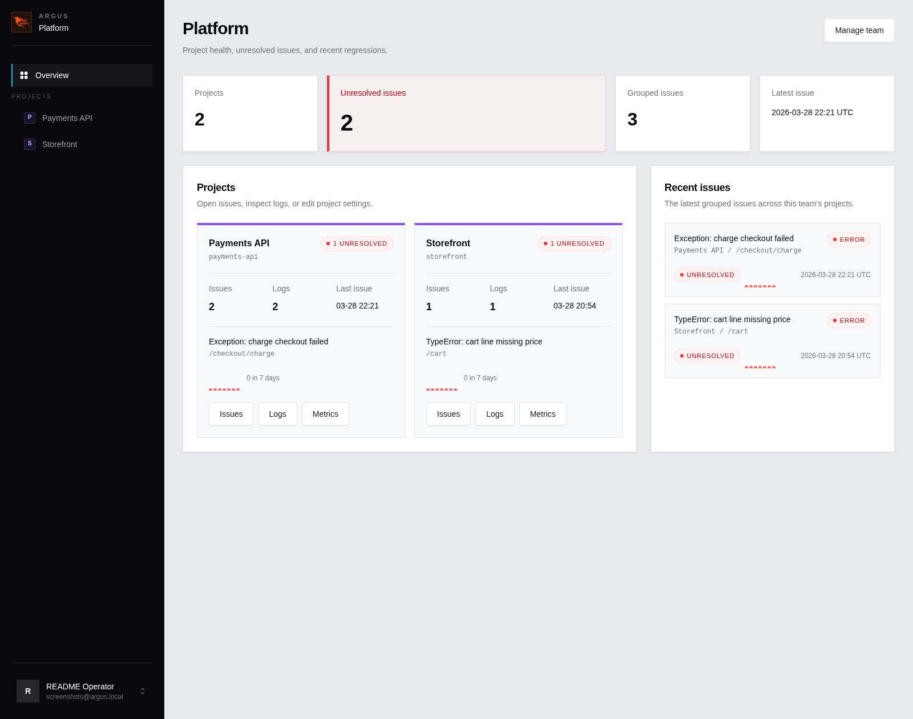
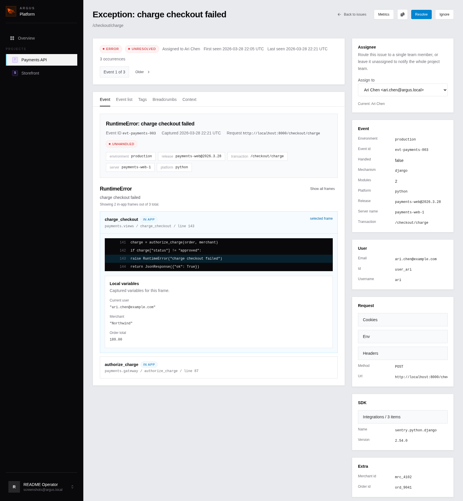
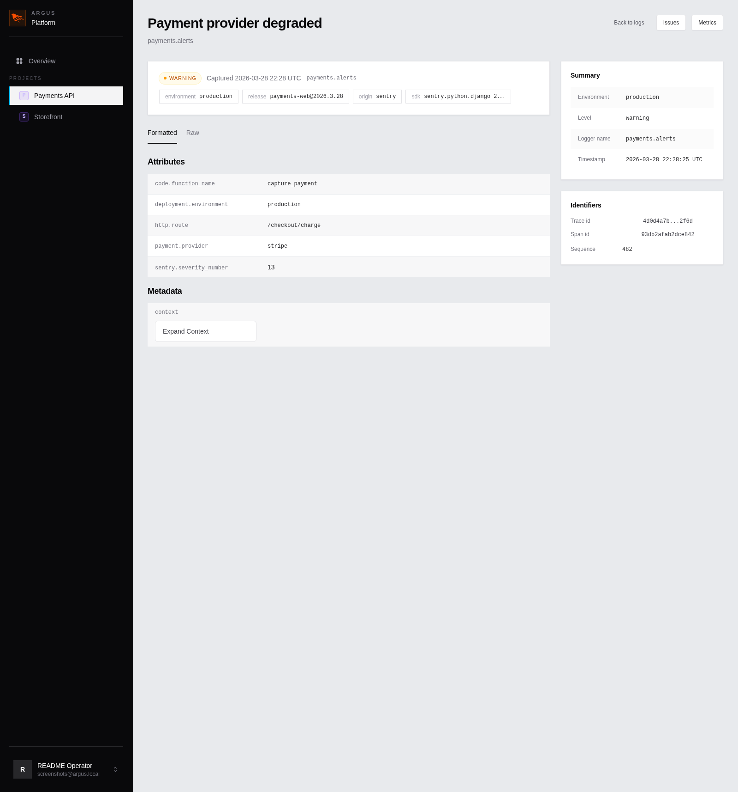
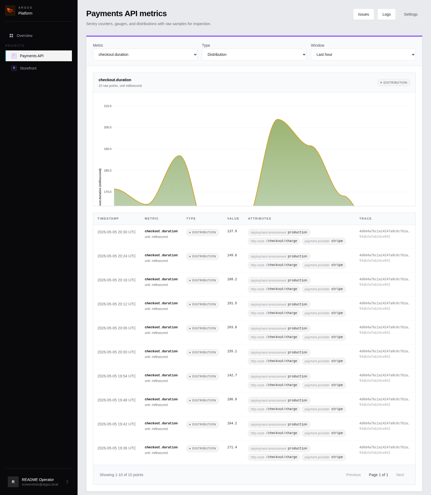

# Argus

Argus is a self-hosted error tracker and log ingester built with Elixir, Phoenix, and LiveView. It accepts Sentry-compatible payloads, groups errors into issues, stores raw events and logs, and exposes an internal UI for triage, project management, and access control.

Each deployment hosts one internal workspace. Admins invite users, teams own projects, LiveView powers the UI, and notification delivery runs after the main write path so ingest stays responsive.

## Screenshots

### Team overview



### Issue detail



### Log detail



### Metrics



## Quick Start

For local development:

1. Install dependencies and prepare the database:

   ```bash
   mix setup
   ```

2. Start the server:

   ```bash
   mix phx.server
   ```

3. Visit `http://localhost:4000`.

For a production or container install, use the [Docker Compose quick install](docs/deployment.md#quick-docker-compose-install).

## Seeded Access

`mix setup` runs the seeds and creates:

- admin email: `admin@argus.local`
- password: `changeme123`

The seed also creates:

- team: `Engineering`
- project: `My First Project`

The project DSN key is printed to stdout when the seeds run.

## Included Today

- Sentry `store` and `envelope` ingestion
- error grouping by fingerprint
- raw occurrences for event-level debugging
- separate log storage with live tail support
- Sentry metrics ingestion with charts and raw metric point inspection
- users, teams, projects, invitations, and issue assignment
- email notifications and optional webhooks for issue lifecycle and manual action events

## Documentation

- [Architecture and Design](docs/architecture.md)
- [Deployment Guide](docs/deployment.md) - release and Docker/container deployment
- [Operations Guide](docs/operations.md)
- [Production Runbook](docs/production.md)
- [Backup and Recovery Playbook](docs/backup-recovery.md)
- [Testing Guide](docs/testing.md)

## Common Commands

Run the full test suite:

```bash
mix test
```

Run the full precommit gate:

```bash
mix precommit
```

Reset the database locally:

```bash
mix ecto.reset
```

Refresh the README screenshots locally:

```bash
bin/screenshots
```

## Development Notes

- Dev mail preview is available at `http://localhost:4000/dev/mailbox`
- Optional issue webhooks are configured per project from the project settings page
- Logs can be rate-limited globally through `config :argus, Argus.Logs.RateLimiter, ...`
- `bin/screenshots` uses the local `chromium` and `chromedriver` binaries and seeds a dedicated screenshot workspace instead of dropping your dev database

## Out of Scope Today

- performance monitoring
- release health
- source maps
- code snippet syntax highlighting
- alert rules and integrations beyond per-project issue webhooks

## License

See [LICENSE](LICENSE).
